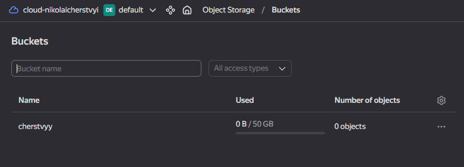
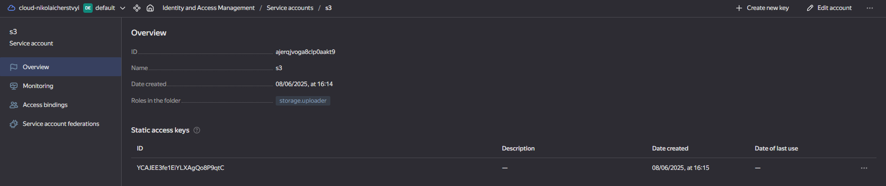
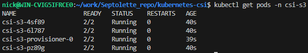
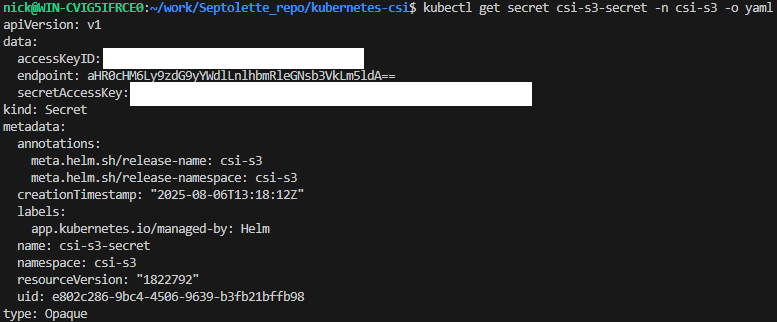
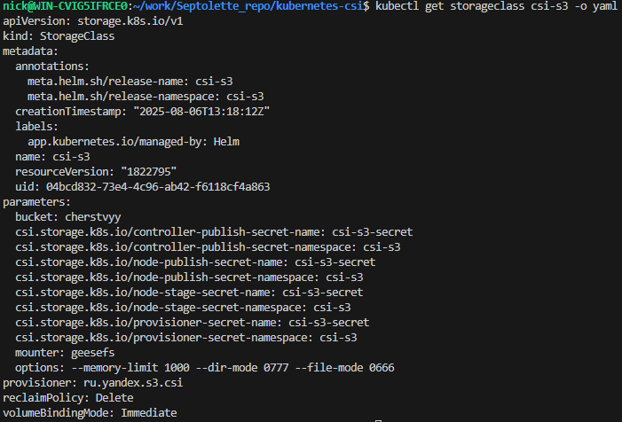
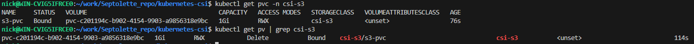
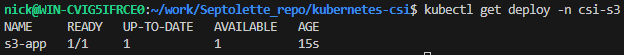
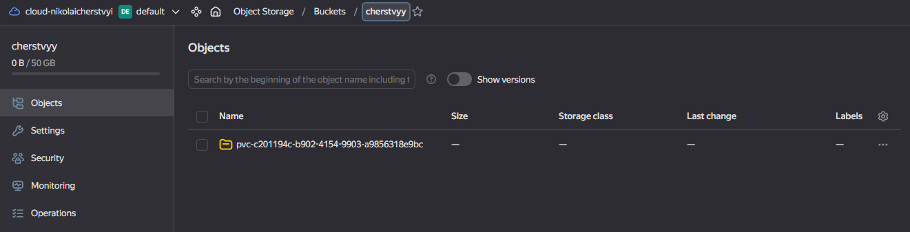
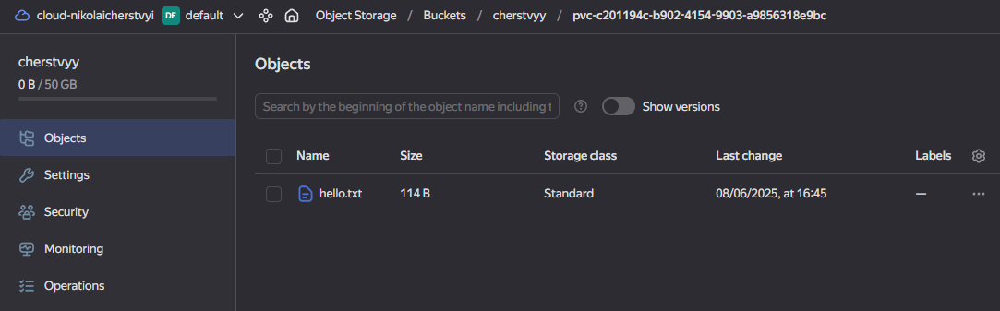

# Создание необходимых namespace
```
kubectl apply -f csi-s3-namespace.yaml
```

# Созданый S3-bucket


# Созданый ServiceAccount и static access key


# Установка csi-s3
```
helm upgrade --install csi-s3 csi-s3/. -n csi-s3
```


# Проверка secret c ключами для доступа к Object Storage
```
kubectl get secret csi-s3-secret -n csi-s3 -o yaml
```


# Проверка StorageClass
```
kubectl get storageclass csi-s3 -o yaml
```


# Создание PVC
```
kubectl apply -f pvc.yaml
kubectl get pvc -n csi-s3
kubectl get pv | grep csi-s3
```


# Создание Deployment
```
kubectl apply -f deployment.yaml
```


# Проверка файла в S3-bucket

