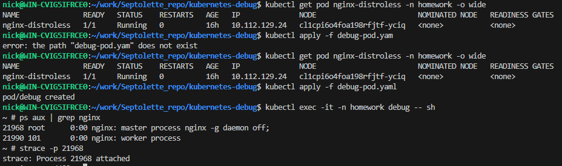

# Создание необходимых namespace
```
kubectl apply -f homework-namespace.yaml
```

# Создание pod
```
kubectl apply -f pod.yaml
```


# Создание отладочного контейнера
```
kubectl debug -it nginx-distroless --image=busybox --target=nginx --share-processes -n homework
```


# Доступ к файловой системе отлаживаемого контейнера
```
ls -la /proc/1/root/etc/nginx
```


# Запуск tcpdump через отладочный контейнер
```
kubectl debug -it nginx-distroless --image=nicolaka/netshoot --target=nginx --share-processes -n homework
tcpdump -nn -i any -e port 80
```

# Обращение к nginx в отлаживаемом pod
```
kubectl port-forward pod/nginx-distroless 8080:80 -n homework
curl http://localhost:8080
```


# Создание отладочного pod для node с nginx
```
kubectl get pod nginx-distroless -o wide -n homework
kubectl debug node/cl1cpi6o4foa198rfjtf-yciq -it --image=nicolaka/netshoot -n homework
ls -la /host/var/log/pods | grep nginx-distroless
cd /host/var/log/pods/homework_nginx-distroless_57a3f55e-f0a6-4c8f-8b6d-a9ee7fa76657/nginx
cat 0.log
```


# Задание с *
```
kubectl get pod nginx-distroless -n homework -o wide
kubectl apply -f debug-pod.yam
kubectl exec -it -n homework debug -- sh
ps aux | grep nginx
strace -p 21968
```
