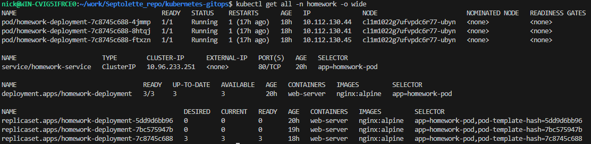

# Скриншот вывода команд "kubectl get node"

# Создание необходимых namespace
kubectl apply -f argocd-namespace.yaml
kubectl apply -f homework-namespace.yaml
kubectl apply -f homeworkhelm-namespace.yaml

# Установка argocd
helm upgrade --install argocd argo-cd/. -f argo-cd/values-new.yaml -n argocd

# Создание AppProject "otus"
kubectl apply -f appproject.yaml

# Создание Application "kubernetes-networks"
kubectl apply -f application1.yaml

# Создание Application "kubernetes-templating"
kubectl apply -f application2.yaml

# Проверка успешной установки приложений "kubernetes-networks" и "kubernetes-templating" в argocd
kubectl port-forward service/argocd-server -n argocd 8080:443
kubectl -n argocd get secret argocd-initial-admin-secret -o jsonpath="{.data.password}" | base64 -d
В браузере переходим по http://localhost:8080 -> Applications

Видим результат:

kubernetes-networks (примечание: homework-ingress находится в состоянии "Progressing", так как не установлен ingress-controller, способный обработать сущность ingress) 

kubernetes-templating
