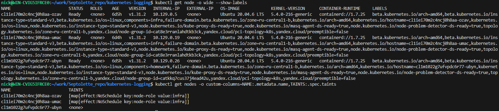
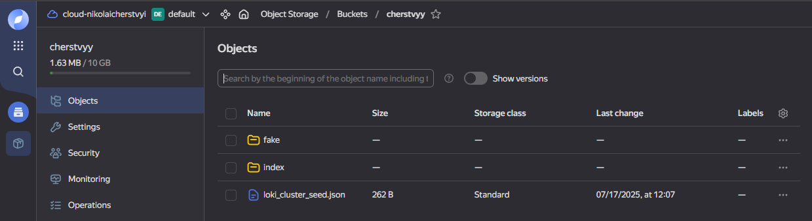
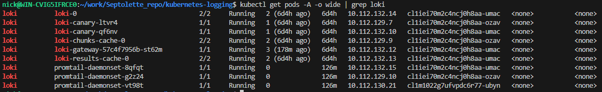
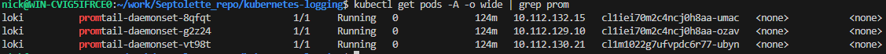
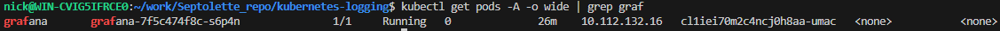
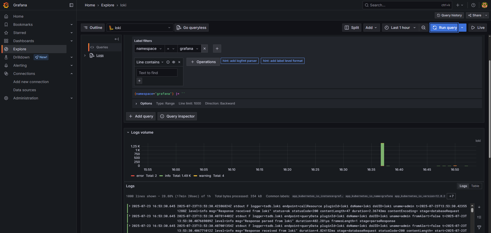

# Скриншот вывода команд "kubectl get node"

# Создание необходимых namespace
kubectl apply -f loki-namespace.yaml
kubectl apply -f grafana-namespace.yaml

# Созданный S3-bucket

# Установка loki
helm install -i loki loki/. -f loki/values-new.yaml -n loki

# Установка promtail
kubectl apply -f promtail.yaml

# Установка grafana
kubectl create secret generic grafana-admin-secret \
  --from-literal=admin-user=admin \
  --from-literal=admin-password=admin \
  -n grafana
helm install grafana grafana/. -f grafana/values-new.yaml -n grafana

# Проверка успешного отображения логов в grafana
kubectl port-forward svc/grafana 8000:80 -n grafana
В браузере переходим по http://localhost:8000 -> Connections -> Data Sources -> loki -> Explore
Видим результат: 
