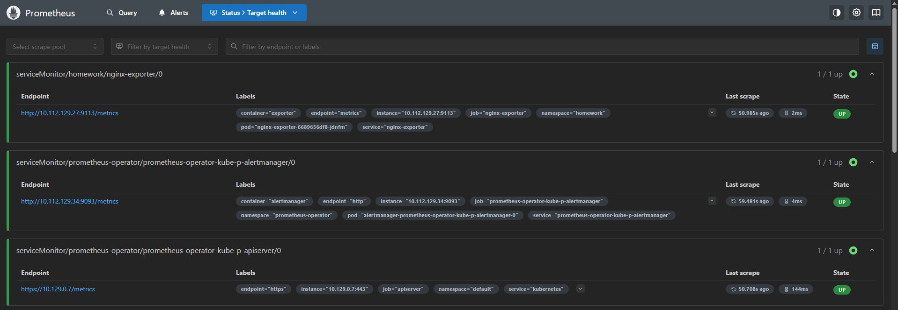

# Создание необходимых namespace
kubectl apply -f homework-namespace.yaml
kubectl apply -f prometheus-operator-namespace.yaml

# Установка prometheus-operator
helm upgrade --install prometheus-operator kube-prometheus/. -n prometheus-operator

# Build и push кастомного docker-образа nginx
docker build -t cherstvyy/nginx-with-status:17.06.2025 nginx/.
docker push cherstvyy/nginx-with-status:17.06.2025

# Создание Deployment, запускающего кастомный docker-образ nginx и service для данного Deployment
kubectl apply -f nginx-deployment.yaml

# Создание Deployment, запускающего nginx-prometheus-exporter и service для данного Deployment
kubectl apply -f nginx-exporter-deployment.yaml

# Создание ServiceMonitor, описывающего сбор метрик с nginx
kubectl apply -f service-monitor.yaml

# Проверка успешного сбора метрик в prometheus
kubectl port-forward svc/prometheus-operator-kube-p-prometheus 9090 -n prometheus-operator
В браузере переходим по http://localhost:9090 -> Status -> Target health
Видим результат: 