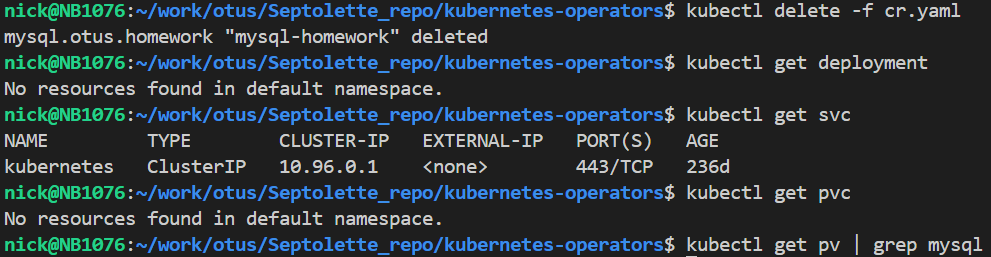

# Основное задание
При применении манифестов есть некоторые проблемы:

1. Всё будет работать только при применении cr.yaml в namespace default, так как в коде оператора присутствует это: 

Т.е. оператор всегда проверяет namespace default.

2. PV создаётся со storageClass "standard", а PVC c "hostpath":

Т.е. в PV приходится вручную прописывать необходимый storageClass.

Результаты проверки после создания cr.yaml:

Результаты проверки после удаления cr.yaml:

# Задание с *
Результаты проверки после создания cr.yaml:

Результаты проверки после удаления cr.yaml:

# Задание с **
Результаты проверки после создания cr.yaml:

Результаты проверки после удаления cr.yaml:
