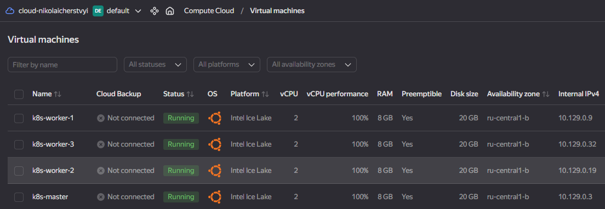
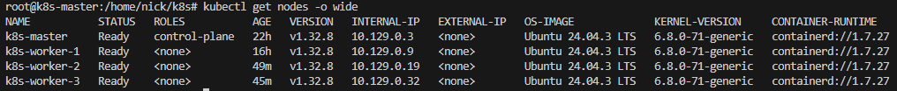
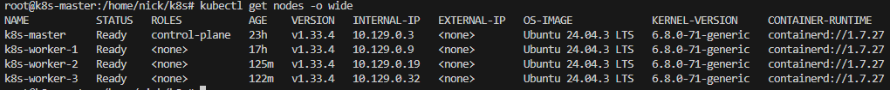
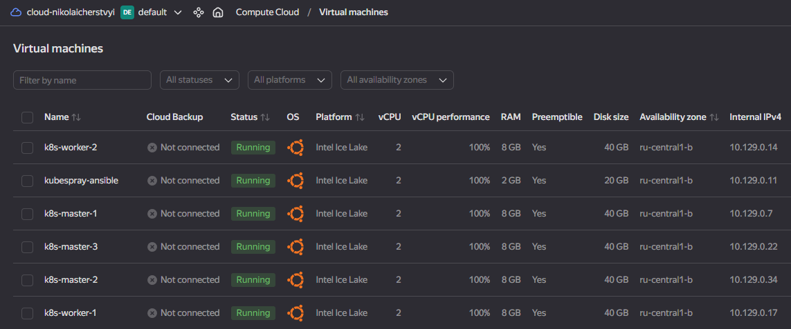
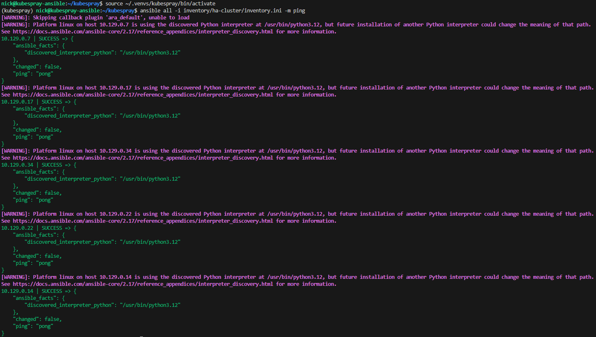
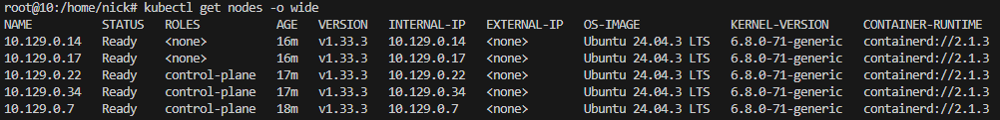

# Основное задание
# Созданные VM в YandexCloud


# Подключение к master по SSH и применение скриптов
```
sudo su
. 01-common-prep.sh
. 02-install-containerd.sh 
. 03-install-kube-packages.sh 
. 04-master-init.sh 
```

# Подключение к worker-1 по SSH и применение скриптов
```
sudo su
. 01-common-prep.sh
. 02-install-containerd.sh 
. 03-install-kube-packages.sh 
. 05-worker-join.sh 
```

# Подключение к worker-2 по SSH и применение скриптов
```
sudo su
. 01-common-prep.sh
. 02-install-containerd.sh 
. 03-install-kube-packages.sh 
. 05-worker-join.sh 
```

# Подключение к worker-3 по SSH и применение скриптов
```
sudo su
. 01-common-prep.sh
. 02-install-containerd.sh 
. 03-install-kube-packages.sh 
. 05-worker-join.sh 
```

# Подключение к master по SSH для проверки состояния кластера
```
sudo su
kubectl get nodes -o wide 
```


# Подключение к master по SSH и обновление master до последней актуальной версии k8s
```
sudo su
. 06-upgrade-master.sh 
```

# Подключение к master по SSH и выполнение drain для worker
```
sudo su
kubectl drain k8s-worker-1 --ignore-daemonsets --delete-emptydir-data
kubectl drain k8s-worker-2 --ignore-daemonsets --delete-emptydir-data 
kubectl drain k8s-worker-3 --ignore-daemonsets --delete-emptydir-data  
```

# Подключение к worker-1 по SSH и обновление worker до последней актуальной версии k8s
```
sudo su
. 07-upgrade-worker.sh 
```

# Подключение к worker-2 по SSH и обновление worker до последней актуальной версии k8s
```
sudo su
. 07-upgrade-worker.sh 
```

# Подключение к worker-3 по SSH и обновление worker до последней актуальной версии k8s
```
sudo su
. 07-upgrade-worker.sh 
```

# Подключение к master по SSH и выполнение uncordon для worker
```
sudo su
kubectl uncordon k8s-worker-1
kubectl uncordon k8s-worker-2
kubectl uncordon k8s-worker-3
```
# Подключение к master по SSH для проверки состояния кластера
```
sudo su
kubectl get nodes -o wide 
```



# Задание с *
# Созданные VM в YandexCloud

# Подключение к ansible-vm по SSH и выполнение предварительных настроек
```
sudo apt update
sudo apt install -y python3-venv python3-pip git sshpass
python3 -m venv ~/.venvs/kubespray && source ~/.venvs/kubespray/bin/activate
source ~/.venvs/kubespray/bin/activate
pip install --upgrade pip
ssh-keygen -t ed25519 -C nick
cat .ssh/id_ed25519.pub
git clone https://github.com/kubernetes-sigs/kubespray.git
cd kubespray
pip install -r requirements.txt 
```

# Подключение к master-1 по SSH и выполнение предварительных настроек
```
sudo swapoff -a
sudo sed -i '/ swap / s/^/#/' /etc/fstab
sudo timedatectl set-ntp true
timedatectl status
nano .ssh/authorized_keys
```

# Подключение к master-2 по SSH и выполнение предварительных настроек
```
sudo swapoff -a
sudo sed -i '/ swap / s/^/#/' /etc/fstab
sudo timedatectl set-ntp true
timedatectl status
nano .ssh/authorized_keys
```

# Подключение к master-3 по SSH и выполнение предварительных настроек
```
sudo swapoff -a
sudo sed -i '/ swap / s/^/#/' /etc/fstab
sudo timedatectl set-ntp true
timedatectl status
nano .ssh/authorized_keys
```

# Подключение к worker-1 по SSH и выполнение предварительных настроек
```
sudo swapoff -a
sudo sed -i '/ swap / s/^/#/' /etc/fstab
sudo timedatectl set-ntp true
timedatectl status
nano .ssh/authorized_keys
```

# Подключение к worker-2 по SSH и выполнение предварительных настроек
```
sudo swapoff -a
sudo sed -i '/ swap / s/^/#/' /etc/fstab
sudo timedatectl set-ntp true
timedatectl status
nano .ssh/authorized_keys
```

# Подключение к ansible-vm по SSH и выполнение установки кластера через kubespray
```
cd kubespray
source ~/.venvs/kubespray/bin/activate
ansible all -i inventory/ha-cluster/inventory.ini -m ping
ansible-playbook -i inventory/ha-cluster/inventory.ini -b cluster.yml
```


# Подключение к master по SSH для проверки состояния кластера
```
sudo su
kubectl get nodes -o wide 
```
