# Создание необходимых namespace
kubectl apply -f consul-namespace.yaml
kubectl apply -f vault-namespace.yaml

# Установка consul
helm upgrade --install consul consul/. -f consul/values-new.yaml -n consul
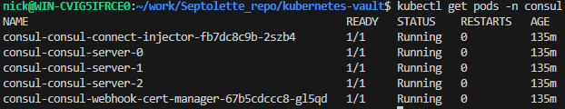

# Установка vault
helm upgrade --install vault vault/. -f vault/values-new.yaml -n vault
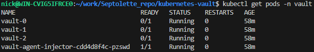

# Инициализация vault
kubectl exec -n vault -it vault-0 -- vault operator init
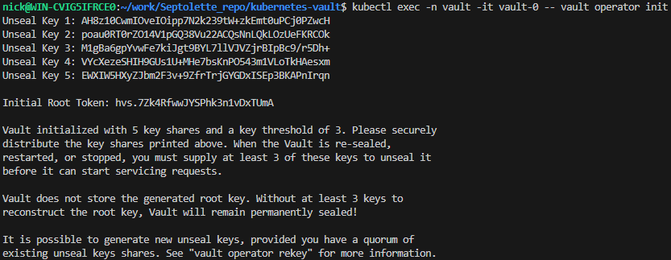

# Распечатывание всех подов хранилища
kubectl exec -n vault -it vault-0 -- vault operator unseal AH8z10CwmIOveIOipp7N2k239tW+zkEmt0uPCj0PZwcH
kubectl exec -n vault -it vault-0 -- vault operator unseal poau0RT0rZO14V1pGQ38Vu22ACQsNnLQkLOzUeFKRCOk
kubectl exec -n vault -it vault-0 -- vault operator unseal M1gBa6gpYvwFe7kiJgt9BYL7llVJVZjrBIpBc9/r5Dh+
kubectl exec -n vault -it vault-0 -- vault status
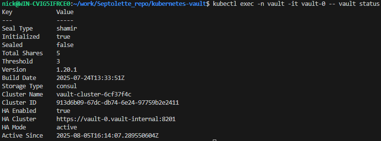
kubectl exec -n vault -it vault-1 -- vault operator unseal AH8z10CwmIOveIOipp7N2k239tW+zkEmt0uPCj0PZwcH
kubectl exec -n vault -it vault-1 -- vault operator unseal poau0RT0rZO14V1pGQ38Vu22ACQsNnLQkLOzUeFKRCOk
kubectl exec -n vault -it vault-1 -- vault operator unseal M1gBa6gpYvwFe7kiJgt9BYL7llVJVZjrBIpBc9/r5Dh+
kubectl exec -n vault -it vault-1 -- vault status

kubectl exec -n vault -it vault-2 -- vault operator unseal AH8z10CwmIOveIOipp7N2k239tW+zkEmt0uPCj0PZwcH
kubectl exec -n vault -it vault-2 -- vault operator unseal poau0RT0rZO14V1pGQ38Vu22ACQsNnLQkLOzUeFKRCOk
kubectl exec -n vault -it vault-2 -- vault operator unseal M1gBa6gpYvwFe7kiJgt9BYL7llVJVZjrBIpBc9/r5Dh+
kubectl exec -n vault -it vault-2 -- vault status
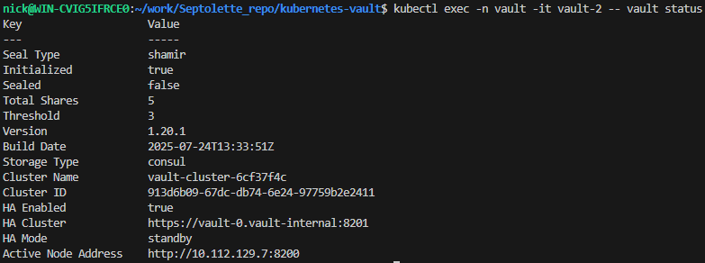

# Создание хранилища секретов otus/ с Secret Engine KV и секрета otus/cred
kubectl exec -n vault -it vault-0 -- /bin/sh
export VAULT_ADDR=http://127.0.0.1:8200
export VAULT_TOKEN=TOKEN
vault secrets enable -path=otus kv
vault kv put otus/cred username="otus" password="asajkjkahs"
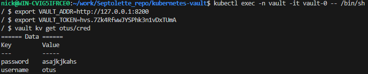

# Создание serviceAccount vault-auth и ClusterRoleBinding
kubectl apply -f vault-auth-sa.yaml

# Создание token для serviceAccount vault-auth
kubectl apply -f vault-auth-token.yaml

# Получение token для serviceAccount vault-auth
kubectl get secret vault-auth-token -n vault -o jsonpath='{.data.token}' | base64 -d

# Получение CA-сертификата для serviceAccount vault-auth
kubectl get secret vault-auth-token -n vault -o jsonpath='{.data.ca\.crt}' | base64 -d

# Включение и конфигурирование авторизации auth/kubernetes
kubectl exec -n vault -it vault-0 -- /bin/sh
export VAULT_ADDR=http://127.0.0.1:8200
export VAULT_TOKEN=TOKEN
vault auth enable kubernetes
vault write auth/kubernetes/config \
    token_reviewer_jwt="SA_TOKEN" \
    kubernetes_host="https://kubernetes.default.svc" \
    kubernetes_ca_cert="CA_CERT"
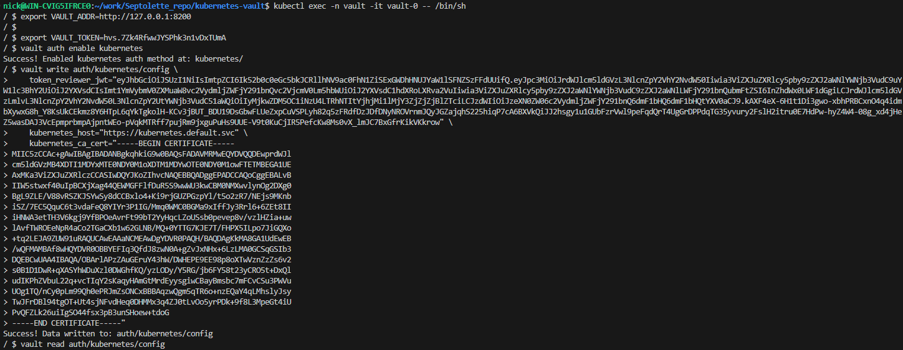
vault read auth/kubernetes/config
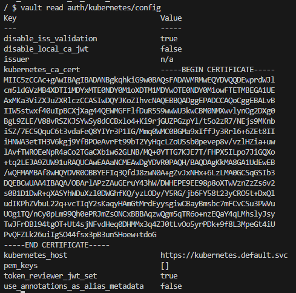

# Создание и применение политики otus-policy
kubectl exec -n vault -it vault-0 -- /bin/sh
cat <<EOF > /vault/otus-policy.hcl
path "otus/cred" {
  capabilities = ["read", "list"]
}
EOF
vault policy write otus-policy /vault/otus-policy.hcl
vault policy read otus-policy
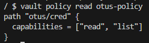

# Создание роли в vault
kubectl exec -n vault -it vault-0 -- /bin/sh
vault write auth/kubernetes/role/otus \
    bound_service_account_names=vault-auth \
    bound_service_account_namespaces=vault \
    policies=otus-policy
vault read auth/kubernetes/role/otus
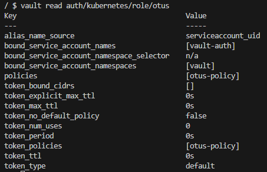

# Установка external-secrets
helm upgrade --install external-secrets external-secrets/. -n vault
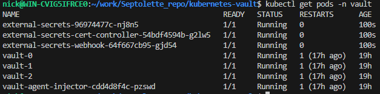

# Создание SecretStore
kubectl apply -f vault-secretstore.yaml
kubectl -n vault get secretstore vault -o yaml
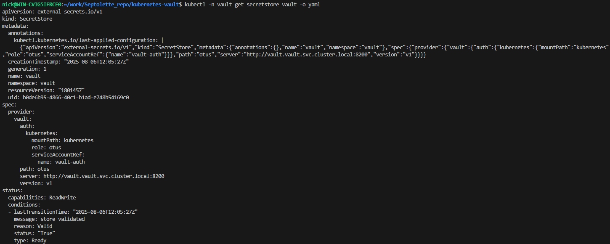

# Создание ExternalSecret
kubectl apply -f vault-externalsecret.yaml
kubectl -n vault get secret otus-cred -o yaml
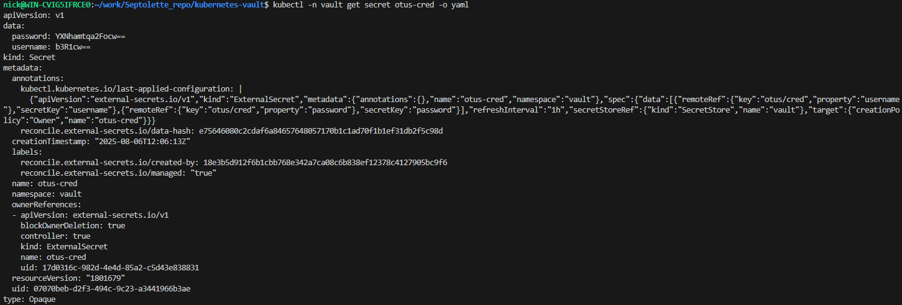